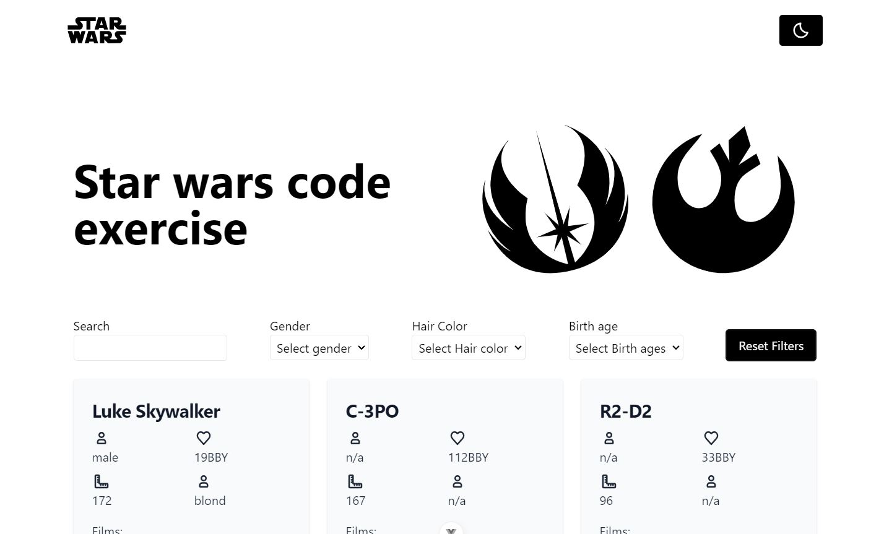

# star-wars-code-exercise

Vue application using Vue router and tanstack query to get data.

## Overview

### The challenge

Users should be able to:

-   See a list of star wars characters in cards
-   Filter by different data like gender or hair color.
-   Paginate the different pages

### Screenshot

### Links

-   Live Site URL: [hstar-wars-code-exercise.netlify.app/](https://star-wars-code-exercise.netlify.app/)

## My process

### Built with

-   Semantic HTML5 markup
-   CSS custom properties
-   Flexbox
-   CSS Grid
-   Mobile-first workflow
-   Vue JS
-   Vue Router
-   Tanstack Query
-   [Tailwind](https://tailwindcss.com) - For styles

Used Tanstack Query for handling the api call and caching data.
